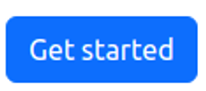
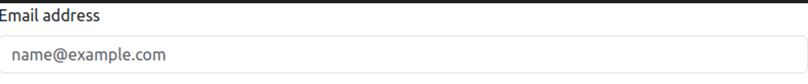
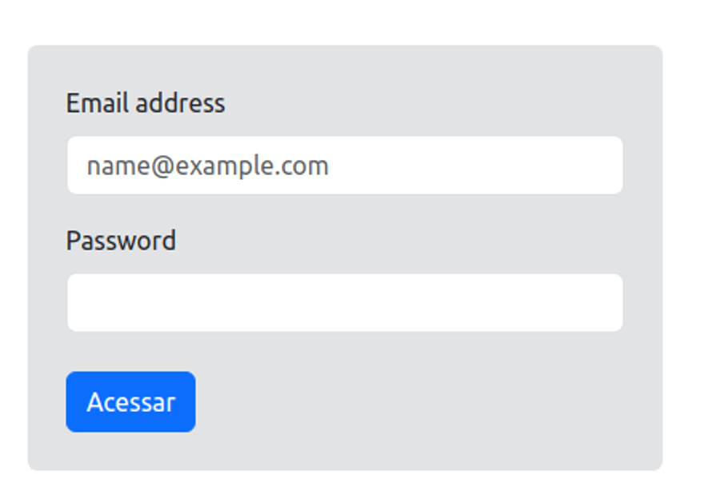

# Bibliotecas CSS

Uma biblioteca CSS é um conjunto de estilos predefinidos que facilita a criação de interfaces de usuário consistentes e esteticamente agradáveis em aplicações web. Essas bibliotecas fornecem classes CSS reutilizáveis que os desenvolvedores podem aplicar aos elementos HTML para estilizar componentes como botões, formulários, layouts e tipografia, sem precisar escrever todo o código CSS do zero.

## Características de uma Biblioteca CSS:
| Reutilizável | Oferece classes e componentes que podem ser usados em diferentes projetos, economizando tempo e esforço. |
| --- | --- |
| Consistência | Garante uma aparência uniforme em todos os elementos da interface do usuário, ajudando a manter um design coeso. |
| Produtividade | Acelera o processo de desenvolvimento, permitindo que os desenvolvedores se concentrem mais na funcionalidade e menos no design. |
| Manutenção Facilitada | Facilita a manutenção do código, pois as classes predefinidas são bem documentadas e padronizadas. |
| Compatibilidade | Muitas bibliotecas são amplamente testadas em diferentes navegadores e dispositivos, garantindo maior compatibilidade e menos problemas de layout |
| Documentação | Geralmente vem com uma documentação abrangente que explica como utilizar as classes e componentes disponíveis. |

## Bootstrap

Bootstrap é uma biblioteca CSS, desenvolvida pelo Twitter, que facilita a criação de interfaces web responsivas e esteticamente agradáveis. Ele fornece um conjunto de ferramentas que incluem estilos CSS predefinidos, componentes prontos e um sistema de grid para organizar o layout da página, comumente essa estilização é aplicada as tags html atravez da definição de classes. Acesse a [documentação](https://getbootstrap.com/) oficial para obter mais informações sobre o Bootstrap.

### **Instalação do Bootstrap via CDN**

Para começar a usar o Bootstrap, a forma mais rápida e fácil é através de uma CDN (Content Delivery Network). Uma CDN é uma rede de servidores distribuídos que entrega conteúdos de forma eficiente e rápida. Vamos ver como fazer isso passo a passo.

1. **Criar um arquivo “index.html” básico.**
    
    Em seu computador crie uma paste com nome a seu critério, e em seguida abra ela com a IDE de sua preferência.
    
    Feito isso, adicione um novo arquivo “index.html” e abra-o. Em seguida, crie a estrutura básica de um documento HTML

```
<!DOCTYPE html>
<html lang="pt-BR">
<head>
  <meta charset="UTF-8">
  <meta name="viewport" content="width=device-width, initial-scale=1.0">
  <title>FS16 - aula 10</title>
</head>
<body>
  
</body>
</html>
```

2. **Incluir o Bootstrap no HTML.**
    
    Agora, adicione no `head` de seu arquivo o seguinte link:

```
<link href="https://cdn.jsdelivr.net/npm/bootstrap@5.3.3/dist/css/bootstrap.min.css" rel="stylesheet" integrity="sha384-QWTKZyjpPEjISv5WaRU9OFeRpok6YctnYmDr5pNlyT2bRjXh0JMhjY6hW+ALEwIH" crossorigin="anonymous">
```
>Esse link será responsável por “linkar” o seu arquivo HTML, com o arquivo de estilização do Bootstrap.

Em seguida, no fim do `body` , inclua a seguinte tag de `script`
```
<script src="https://cdn.jsdelivr.net/npm/bootstrap@5.3.3/dist/js/bootstrap.bundle.min.js" integrity="sha384-YvpcrYf0tY3lHB60NNkmXc5s9fDVZLESaAA55NDzOxhy9GkcIdslK1eN7N6jIeHz" crossorigin="anonymous"></script>
```
>Alguns componentes do Bootstrap utilizam o JavaScript para interagir com o usuário, esse trecho do “script” será o responsável por importar essa interação para sua página.

Se tudo tiver certo até aqui, seu código deverá está semelhante a este:

```
<!DOCTYPE html>
<html lang="pt-BR">
<head>
  <meta charset="UTF-8">
  <meta name="viewport" content="width=device-width, initial-scale=1.0">
  <title>FS16 - aula 10</title>
  <link href="https://cdn.jsdelivr.net/npm/bootstrap@5.3.3/dist/css/bootstrap.min.css" rel="stylesheet" integrity="sha384-QWTKZyjpPEjISv5WaRU9OFeRpok6YctnYmDr5pNlyT2bRjXh0JMhjY6hW+ALEwIH" crossorigin="anonymous">
</head>
<body>
  
  <script src="https://cdn.jsdelivr.net/npm/bootstrap@5.3.3/dist/js/bootstrap.bundle.min.js" integrity="sha384-YvpcrYf0tY3lHB60NNkmXc5s9fDVZLESaAA55NDzOxhy9GkcIdslK1eN7N6jIeHz" crossorigin="anonymous"></script>
</body>
</html>
```
Com isso concluimos a intalação do Bootstrap em nosso projeto, via o CDN.

### Primeiros componentes com Bootstap.

Agora vamos praticar um pouco.

- **Desafio 1**
    
    Este dessafio consiste em desenvolver um simples botão, contendo o palavra “Get started”, com bordas arredondadas. Não é  necessário atribuir uma ação para esse botão.
    
    Ao final o desafio, deveremos ter algo semelhante a isso:
    
    

    Agora é a sua vez, logo mais iremos apresentar uma das possíveis soluções para esse desafio.

    - **Desafio 2**
    
    Agora nosso novo desafio vai  ser criar um campo onde o usuário poderá, preecher com seu email. Esse campo de ve conter uma `label` que o identifique, com o nome “email”.
    
    Ao final do desafio, esperamos ter algo semelhante a isso:

    

    Agora é com você, logo mais iremos apresentar uma das possíveis soluções para esse desafio.

    - **Desafio 3 (BOSS)**
    
    Agora o vamos subir um pouco mais a complexidade, e nosso novo desafio vai ser implementar um formulário de login (usuário e senha). Onde o usuário deverá preencher os campos de email e senha, e em seguida, clicar no botão acessar, para que realiar o login.
    
    Obs.: Não é necessário implementar nem uma ação nesse formulario ainda. Nesse desafio deveremos desenvolver apenas os campos e botão do formulário.
    
    Ao final do desafio, o que queremos obter é um resiltado semelhante a este:

    

    ## Tailwind

Tailwind CSS é uma biblioteca CSS que adota uma abordagem "utility-first", fornecendo classes utilitárias de baixo nível que você pode usar para construir qualquer design diretamente em seu HTML. Diferente de outras bibliotecas CSS, como o Bootstrap, que fornecem componentes predefinidos, o Tailwind oferece uma vasta coleção de classes utilitárias para estilizar seus elementos de maneira granular e altamente customizável. Para saber mais acesse a [Documentação do Tailwind](https://tailwindcss.com/)

### **Instalação do Tailwind via CDN**

Para começar a usar o Tailwind CSS, a forma mais rápida e fácil é através de uma CDN. Vamos ver como fazer isso passo a passo.

1. **Criar um arquivo “index.html” básico.**
    
    Em seu computador crie uma paste com nome a seu critério, e em seguida abra ela com a IDE de sua preferência.
    
    Feito isso, adicione um novo arquivo “index.html” e abra-o. Em seguida, crie a estrutura básica de um documento HTML.

```
    <!DOCTYPE html>
<html lang="pt-BR">
<head>
  <meta charset="UTF-8">
  <meta name="viewport" content="width=device-width, initial-scale=1.0">
  <title>FS16 - aula 10</title>
</head>
<body>
  
</body>
</html>
```
Incluir o Tailwind no HTML.
Agora, adicione no head de seu arquivo o seguinte link:
```
  <script src="https://cdn.tailwindcss.com"></script>
```

Se tudo tiver certo até aqui, seu código deverá está semelhante a este:
```
<!DOCTYPE html>
<html lang="pt-BR">

<head>
    <meta charset="UTF-8">
    <meta name="viewport" content="width=device-width, initial-scale=1.0">
    <title>FS16 - aula10</title>
    <script src="https://cdn.tailwindcss.com"></script>
</head>
<body>

</body>
</html>
```

Se tudo tiver certo até aqui, seu código deverá está semelhante a este:

```
<!DOCTYPE html>
<html lang="pt-BR">

<head>
    <meta charset="UTF-8">
    <meta name="viewport" content="width=device-width, initial-scale=1.0">
    <title>FS16 - aula10</title>
    <script src="https://cdn.tailwindcss.com"></script>
</head>
<body>

</body>
</html>
```

### Primeiros componentes com Bootstap.

Agora vamos praticar um pouco.

- **Desafio 1**
    
    Este dessafio consiste em desenvolver um simples botão, contendo o palavra “Get started”, com bordas arredondadas. Não é  necessário atribuir uma ação para esse botão.
    
    Ao final o desafio, deveremos ter algo semelhante a isso:
    
     

     Agora é a sua vez, logo mais iremos apresentar uma das possíveis soluções para esse desafio.

     - **Desafio 2**
    
    Agora nosso novo desafio vai  ser criar um campo onde o usuário poderá, preecher com seu email. Esse campo de ve conter uma `label` que o identifique, com o nome “email”.
    
    Ao final do desafio, esperamos ter algo semelhante a isso:
    

    Agora é com você, logo mais iremos apresentar uma das possíveis soluções para esse desafio.

    - **Desafio 3 (BOSS)**
    
    Agora o vamos subir um pouco mais a complexidade, e nosso novo desafio vai ser implementar um formulário de login (usuário e senha). Onde o usuário deverá preencher os campos de email e senha, e em seguida, clicar no botão acessar, para que realiar o login.
    
    Obs.: Não é necessário implementar nem uma ação nesse formulario ainda. Nesse desafio deveremos desenvolver apenas os campos e botão do formulário.
    
    Ao final do desafio, o que queremos obter é um resultado semelhante a este:


## 🏡 Tarefa de casa:

- Continuar o desenvolvimento de uma das página do [Repositório da turma](https://github.com/devronier/fs16s), e tentar implementar uma biblioteca css no projeto escolhido.

