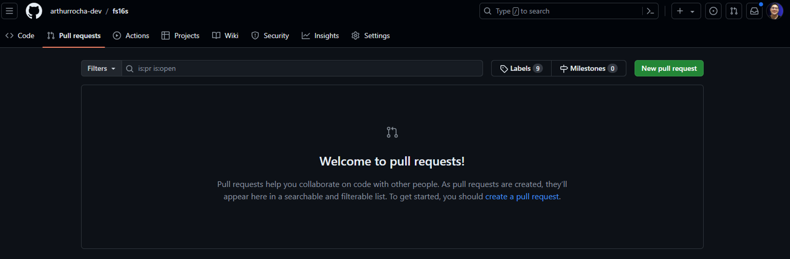
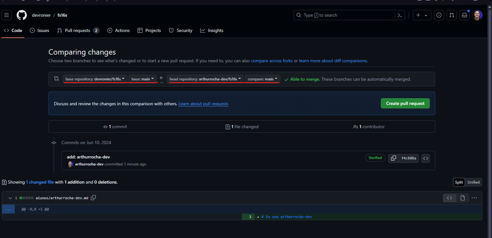

## Merge Request / Pull Request.

**Merge Request (MR) / Pull Request (PR)**: São funcionalidades fornecidas por sistemas de controle de versão, como GitHub e GitLab, que permitem que desenvolvedores proponham alterações em um repositório de código. Eles são processos estruturados para a integração de mudanças no código, onde as modificações são submetidas para revisão antes de serem mescladas na branch principal do projeto. O termo PR é usado no GitHub e o termo MR no GitLab, mas ambos têm a mesma finalidade e funcionam de maneira similar.

## Atividade:

Nesta atividade vamos aprender como contribuir com um projeto “open source” do GitHub.

### Passo a Passo

1. Fork
    
    Um fork **é um novo repositório que compartilha configurações de código e visibilidade com o repositório "upstream" original**.
    
    Para fazer um fork vamos seguir dois passos simples
    
    - Acesse o repositório no GitHub que deseja contribuir.
    - Clique no botão "Fork" no canto superior direito.
    
2. **Clone**
    
    Após a realização do fork, vamos colocar o projeto, em nosso repositório. Para isso, vamos seguir o fluxo convencional de clonagem de um repositório.
    
    ```bash
    git clone <URL do repositório>
    ```
    
3. **Edição do projeto.**
    
    Com o repositório devidamente clonado, em nosso computador local, iremos realizar a modificação do arquivo.
    
     
    
4. **Abertura de um MR/PR**
    
    Pro fim, iremos realizar o envio das modificações realizadas para o repositório e criar um novo Merge Request/Pull Request. Para isso, vamos segui os seguintes passos:
    
    1. **git add**
        
        ```bash
        git add .
        ```
        
    2. **git commit**
        
        ```bash
        git commit -m "<mensagem do commit>"
        ```
        
    3. **git push**
        
        ```bash
        git push <repositorio> <branch>
        ```
        
    4. **Abertura do MR/PR**
        
        Agora que temos uma nova modificação em nosso repositório “forkado”, podemos abrir a solicitação para mergear, nossa versão, com a versão principal do repositório de origem.
        
        Para isso, em nosso, repositório GitHub, vamos clicar em “Pull Request”
        
        


    E em seguida clicar em “New pull Request”. 

    Feito isso, observe que a origem e o destino, do nosso Pull Request.
    

    E em seguida, clique em “Create pull request”.

    Fazendo isso, se acessarmos o repositório original do projeto e acessarmos a página de “Pull Request”, poderemos observar que nossa solicitação estará presente lá. E assim que aceita, pelo dono do projeto, entraremos como contribuidor do projeto.

    ## Tarefa de casa:

    - Estudar sobre o [**workflows](https://docs.github.com/en/actions/using-workflows).**

    ## Para saber mais:

    [**Git - minicurso](https://www.youtube.com/watch?v=ts-H3W1uLMM).**

    [**Fork - Como fazer](https://www.youtube.com/watch?v=b32O0dJkUHE).**
    
    [**Programação Profissional](https://www.youtube.com/watch?v=pGccuvDa7X4).**
