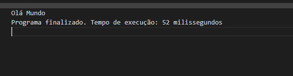

## Introdução a linguagem de programação.

Diferente das linguagens naturais, que servem como veículo de comunicação entre pessoas, as linguagens de programação são artificiais, criadas para interagir com uma máquina. Os programadores usam um conjunto de regras léxicas, sintáticas e semânticas para criar programas informáticos (ebac, 2024).

## Linguagem de programação
Uma linguagem de programação é um conjunto de instruções e regras usadas para comunicar-se com computadores e criar programas de software.

Exemplo de linguagens de programação:

- **Python:** Simples e legível, usada em desenvolvimento web, ciência de dados, etc.
- **JavaScript:** Principal para desenvolvimento web.
- **Java:** Usada em aplicativos empresariais e Android.
- **C/C++:** Usadas em sistemas, jogos e aplicativos de alto desempenho.
- **Ruby:** Simples, usada com o framework Ruby on Rails.

As linguagens de programação podem ser categorizadas em dois principais tipos: **compiladas** e **interpretadas**.  

## Linguagem compilada
Linguagens compiladas são aquelas em que o código-fonte é traduzido para código de máquina (binário) antes de ser executado. Esse processo de tradução é feito por um compilador.

**Processo:**

1. **Escrita do Código:** O desenvolvedor escreve o código-fonte em uma linguagem de alto nível.
2. **Compilação:** O compilador traduz todo o código-fonte para código de máquina, gerando um arquivo executável.
3. **Execução:** O arquivo executável pode ser executado diretamente pelo sistema operacional.

**Vantagens:**

- **Desempenho:** Programas compilados geralmente executam mais rápido porque o código de máquina é diretamente executado pelo processador.
- **Distribuição:** O código compilado pode ser distribuído sem revelar o código-fonte, protegendo a propriedade intelectual.

- **Erro em Tempo de Compilação:** Muitos erros são detectados durante a compilação, antes mesmo da execução do programa.

**Desvantagens:**

- **Portabilidade:** O código compilado é específico para a arquitetura do processador e o sistema operacional, o que pode exigir diferentes versões do programa para diferentes plataformas.
- **Tempo de Compilação:** A compilação pode ser um processo demorado, especialmente para programas grandes.

## Linguagem interpretada
Linguagens interpretadas são aquelas em que o código-fonte é executado linha por linha por um interpretador, sem a necessidade de uma fase de compilação completa antes da execução.

**Processo:**

1. **Escrita do Código:** O desenvolvedor escreve o código-fonte em uma linguagem de alto nível.
2. **Execução:** O interpretador lê e executa o código-fonte linha por linha.

**Vantagens:**

- **Portabilidade:** O mesmo código-fonte pode ser executado em diferentes plataformas, desde que o interpretador esteja disponível.
- **Desenvolvimento Rápido:** O ciclo de desenvolvimento é mais rápido porque não há uma etapa de compilação demorada. Mudanças no código podem ser testadas imediatamente.

- **Flexibilidade:** Facilidade em testes e depuração, pois o código é executado em tempo real.

**Desvantagens:**

- **Desempenho:** Programas interpretados geralmente são mais lentos porque o código precisa ser traduzido em tempo de execução.
- **Segurança:** O código-fonte precisa ser distribuído junto com o interpretador, o que pode expor a propriedade intelectual.

## Algoritmo

O que é um algoritmo?

Bom, durante nosso dia a dia, mesmo sem saber, lidamos com algoritmos, veja um exemplo de um algoritmo que a grande maioria das pessoas utilizam quase todos os dias pela manhã:

...
1. Pegar escova de dentes;
2. Aplicar pasta de dente na escova;
3. Abrir torneira;
4. Molhar escova com pasta de dente;
5. Fechar torneira;
6. Colocar escova na boca;
7. Escovar dentes com movimentos circulares por 2 minutos;
8. Escovar a língua e gengivas;
9. Abrir torneira;
10. Enxaguar a boca com água;
11. Fechar torneira;
12. Lavar escova em água corrente;
13. Fechar torneira;
14. Guardar escova de dentes;
15. Limpar pia;
16. Lavar as mãos com água e sabão;
...

Em sua essência, um algoritmo nada mais é do que uma sequência de passos a serem seguidos para realizar uma tarefa específica. Assim como nós, humanos, seguimos uma sequência de passos para realizar atividades diárias, um computador também precisa seguir uma sequência de passos bem definidos para executar qualquer tarefa.

No exemplo apresentado, temos o que chamamos de pseudocódigo, de um algoritmo de escovação dental.

## Mas o que é um pseudocódigo?
Pseudocódigo é uma **descrição de um algoritmo usando uma linguagem simplificada** que combina elementos da linguagem natural e da programação. Ele **não segue a sintaxe de uma linguagem de programação específica**, mas é suficientemente **estruturado para ser facilmente traduzido para código real posteriormente**.

O pseudocódigo serve como uma ferramenta intermediária entre a concepção do algoritmo e sua implementação em uma linguagem de programação. Ele permite que os programadores planejem a **lógica** do seu código de uma maneira que seja fácil de entender e modificar antes de traduzi-la para uma linguagem de programação específica.

Nos tópicos anteriores vimos o que é um algoritmo, e o que é um pseudocódigo. Vamos relembrar um pouco do algoritmo que foi apresentado: 
...
1. Pegar escova de dentes;
2. Aplicar pasta de dente na escova;
3. Abrir torneira;
4. Molhar escova com pasta de dente;
5. Fechar torneira;
6. Colocar escova na boca;
...

Bom, e se trocássemos a ordem das instruções? Por exemplo, se na verdade nosso algoritmo fosse da seguinte forma:
...
1. Abrir torneira;
2. Pegar escova de dentes;
3. Colocar escova na boca;
4. Aplicar pasta de dente na escova;
5. Fechar torneira;
6. Molhar escova com pasta de dente;
...
**Ops!!!** Acho que agora temos um problema.

Seguindo esse algoritmo, será que teremos o resultado que esperávamos? A não ser que esperássemos ter uma escova seca com o cabo melado de pasta de dente e alguma quantidade de água desperdiçada, a resposta para essa pergunta seria **NÃO**.

Inicialmente, nosso algoritmo funcionava perfeitamente, e agora não funciona mais. Isso se dá porque, quando mudamos a ordem com a qual as instruções eram passada, deixamos de usar uma coisa essencial para um desenvolvedor, que é a Lógica.
 

- **Logica de programação:**

Lógica de programação é o processo de organizar sequências de instruções ou passos que serão seguidos para resolver um problema específico ou executar uma tarefa. Ela é fundamental para o desenvolvimento de software, pois permite que os programadores pensem de forma estruturada e sistemática sobre a solução de problemas.

## Hora de por a mão na masssa
Para praticar o que aprendemos até agora, vamos utilizar o **Portugol**. O Portugol é uma ferramenta que permite criar algoritmos usando uma linguagem próxima do português, facilitando o aprendizado de lógica de programação.

Inicialmente acesse o site [https://portugol.dev](https://portugol.dev/) para ter acesso ao Webstudio do Portugol.

Em seguida, clique em “Novo arquivo”

Agora vamos fazer nosso primeiro “Olá mundo”. Para isso, digite o seguinte código no arquivo gerado.
...
programa {
  funcao inicio() {
    escreva("Olá Mundo")
  }
}
...

Fazendo isso, você deve ter o seguinte resultado no terminal da plataforma:

## Desafios:

Vamos ao desafio.

Caso necessário, você pode acessar a aba de “Ajuda” do Protugol.

### Desafio 1

Este desafio consiste em desenvolver um programa, capaz de imprimir a seguinte frase “Sou um programador Portugol”.

### Desafio 2

escreva um algoritmo, que deverá seguir o seguinte pseudocódigo:

1. Escreva a frase: “ Digite aqui o seu nome:”;
2. Leia o valor de entrada informado pelo usuário (leia);
3. Escreva a frase:”Meu nome é: {nome_informado}”
    
    Nesse passo, você poderá utilizar de variáveis para armazenar o nome da pessoa.
    

### Desafio 3 (BOSS)

Agora o desafio é: Precisamos desenvolver um programa capaz de receber dois valores. `num1` `num2`  e em seguida realizar alguma operação matemática com esses valor e exibir o resultado dessa operação no terminal do Webstudio.

No fim dessa página estão as respostas para esse desafio, mas lembre-se de duas coisas

1. Pescar/Colar a resposta antes de tentar não é legal realizar o desafio não é legal, e pode atrapalhar seu aprendizado.
2. As respostas apresentadas, será apenas uma das diversas formar possíveis de implementação. 

**Agora é com você!!!**

## Tarefa de casa:

- Pesquisar e estudar sobre **Tabela verdade**.
- Praticar lógica de programação com o site **Racha cuca**.
- Pesquisar sobre os tipos de variáveis em **javaScript**.
- Executar os exemplos do [**Portugol**](https://portugol.dev).

---

## Resolução dos desafios

## Desafio 1
programa {
  funcao inicio() {
    escreva("Sou um programador Portugol")
  }
}

## Desafio 2
programa {
  funcao inicio() {
    cadeia nome
    
    escreva("Digite aqui o seu nome: \n")

    leia(nome)

    escreva("\nMeu nome é: " + nome)
  }
}    

## Desafio 3
## Tarefa de casa:

- Pesquisar e estudar sobre **Tabela verdade**.
- Praticar lógica de programação com o site **Racha cuca**.
- Pesquisar sobre os tipos de variáveis em **javaScript**.
- Executar os exemplos do [**Portugol**](https://portugol.dev).

---

## Resolução dos desafios   